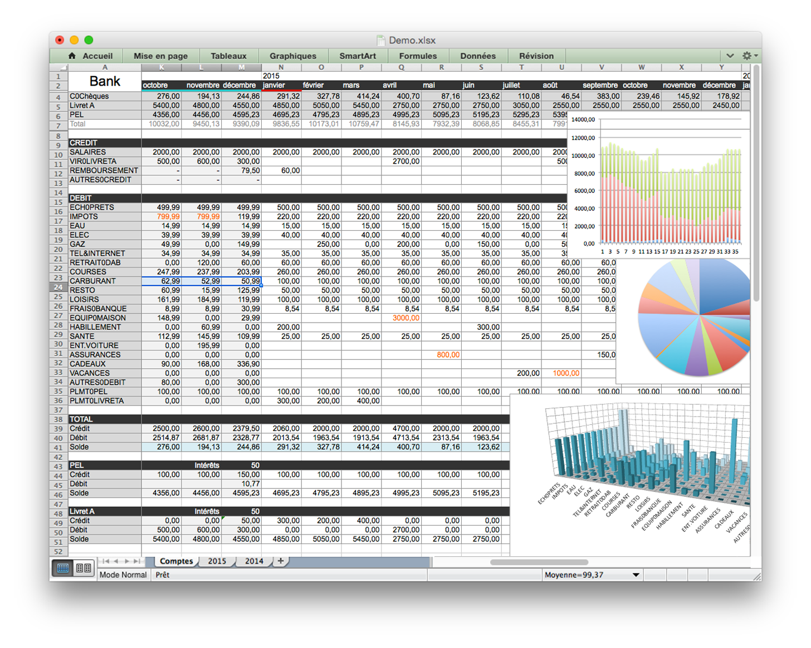

Bank :: personal finance manager
===============================

A command line tool and an XLS document to keep track of expenses, check account balance and plan solid budgets. With automated Cyberplus import. 

Features
--------

Command line tool : automation

* Import last operations from Cyberplus (Banque Populaire website)
* Import operations from local CSV files
* Clean merge of imported operations
* Categorization or operations with learning
* Display a clear report for the current month
* Keep the Excel document clean with validation and checksums, build summaries

Excel document : analysis and budget planning

* Operations archives by years
* Monthly balances for sanity check: matching with bank statements
* Adjusted montly balances: avoid operations like salaries to be counted twice in the same time period, even if both are in the same month.
* Budget timeline, a clear view on past and future budgets

Usage 
-----

### Cyberplus import

Retrieve latest operations from Cyberplus (Banque Populaire de l'Ouest, France), and merge it in the Excel file to avoid duplicate entries, preserve website's operations order and earlier categorisations.

```
$ bank import
--------------------------------------------------------------------------------
-- CYBERPLUS DONWLOAD                                                         --
--------------------------------------------------------------------------------
Account : 106XXXXXXXXXX 
Start   : 17/01/2015
End     : 22/01/2015 
--------------------------------------------------------------------------------
[login] Get session cookies and token ...... ok.
[login] Post authentication data ......... ok.
[login] Load cyberplus portal  ... ok.
[export] Initialize export action ..... ok.
[export] Select CSV export format .. ok.
[export] Select CSV options .. ok.
[export] Select account and date range ... ok.
[export] Download last operations .... ok.
--------------------------------------------------------------------------------
Completed, 6 operations downloaded
--------------------------------------------------------------------------------
-- MERGE                                                                      -- 
--------------------------------------------------------------------------------
DUPLICATE [05/01/15;PRLV SEPA Bouygues Telec B2K0000XX8X01;01XXXXXM9;05/01/15;-15.99;INTERNET]
DUPLICATE [05/01/15;CARTE 020115 CB:******** DECATHLON 0032;08XXXX;05/01/15;-13.9;HABILLEMENT]
+NEW LINE [05/01/15;CARTE 010115 CB:******** BURGER KING NFCXXXXXXX;08XXXX;05/01/15;-16;RESTO]
+NEW LINE [05/01/15;CARTE 020115 CB:******** AMAZON PAYMENTS7/;08XXXX;05/01/15;-16.08;LOISIRS]
+NEW LINE [05/01/15;CARTE 040115 CB:******** E.LECLERC DRIVE  ;08XXXX;05/01/15;-64.44;COURSES]
```


### Categorization

Fast review of new operations with automatic categorization, asking and learning if categorization is not found.

```
$ bank catego
--------------------------------------------------------------------------------
-- CATEGORIZATION                                                             --
--------------------------------------------------------------------------------
Date Op.  : 08/01/15    Date Compta.  : 08/01/15
Libelle : PRLV SEPA FREE MOBILE FM-XXXXXXXXX-1
Reference : XXXXXXXX
Montant   : -3.99
Found : TELEPHONE
Is catego valid ? (Y/n) >
--------------------------------------------------------------------------------
Date Op.  : 05/01/15    Date Compta.  : 05/01/15
Libelle : CARTE 040115 CB:*XXXXXXXXX E.LECLERC DRIVEXXXXXXX
Reference : XXXXXXXX
Montant   : -64.44
Found : COURSES
Is catego valid ? (Y/n) >
--------------------------------------------------------------------------------
```

### Balance and Budget

Displays an accurate summary of accounts status, on the adjusted time period so that recurrent operations won't be counted twice if they happen on the same calendar month. 

```
$ bank calc
+---------------+----------+----------+----------+--------------------+
|1/2015         |  PREVIS. |  ACTUEL  |   DIFF   |       GRAPH        |
+---------------+----------+----------+----------+--------------------+
|SALAIRE        |   2000,00|   2005,00|     -5,00|#################+1%|
|REMBOURSEMENT  |     60,00|      0,00|     60,00|....................|
+---------------+----------+----------+----------+--------------------+
|MAISON         |    500,00|      0,00|    500,00|....................|
|IMPOTS         |    200,00|      0,00|    200,00|....................|
|EAU            |     20,00|      0,00|     15,99|....................|
|ELEC           |     40,00|      0,00|     39,88|....................|
|TEL&INTERNET   |     19,98|     15,99|      3,99|#################...|
|RETRAIT        |    160,00|    130,00|     30,00|#################...|
|COURSES        |    300,00|    281,73|     18,27|###################.|
|CARBURANT      |    100,00|      0,00|    100,00|....................|
|RESTO          |     80,00|     74,50|      5,50|###################.|
|LOISIRS        |    180,00|     97,24|     82,76|###########.........|
|HABILLEMENT    |    200,00|     13,90|    186,10|##..................|
|PLMT.PEL       |    100,00|      0,00|    100,00|....................|
+---------------+----------+----------+----------+--------------------+
|CREDIT         |   2060,00|   2005,00|    -55,00|###################.|
|DEBIT          |   1899,98|    613,36|   1836,72|########............|
+---------------+----------+----------+----------+--------------------+
|SOLDE          |    160,02|   2166,32|   1891,72|                    |
+---------------+----------+----------+----------+--------------------+
```

### All in a row 

Does import, merge, categorization, review, and summary with one command.


```
$ bank all
```

### Complete list of options

```
Usage : bank <command> 
Commands : 
	all        Run import, catego and calc commands
	fileimport Import CSV files from disk
	import     Import data from Cyberplus
	catego     Launch operations categorization
	calc       Do calculations and print report
	period     Start a new 'adjusted month'
	server 	   Launch embedded http server

Maintenance commands : 
	version    Print version
	pwd        Set/update password, stored with encryption
	setup      Initial setup
	test       Test configuration
	  -f       Force for more tests
	  -h       Print health report
```

Bank.xls
--------

An XLS document that stores everything :

* Detailed operations, grouped by years in separated sheets, with monthly summaries
* The timeline : many years in the past to help predict budget many years in the future.

If the command line breaks, this document can be maintained manually, it doesn't needs the command line tool. It just requires more patience :)

About the usage : full review quarterly, update of new know expenses and incomes weekly.




Webapp
------

Web UI for Desktop / Mobile. AngularJS + Bootstrap. Server is embeded in bank app.

```
$ bank server
```


Installation 
------------

Requirements

* Tested on Mac OS 10.9+
* JDK 7+
* Maven
* Git

```
git clone git@bitbucket.org:sleroux/bank.git
cd bank
./compile
./install # Root password prompted during install
```

Configuration 
-------------


```
$ bank setup
# Start Bank configuration ...
# Config file created :
# /Users/sleroux/.bank

$ bank pwd
# Update Cyberplus password for account : EMPTY
# Login : login
# Login : xxxxxxxx
# Confirm : xxxxxxxx
# Update finished

$ bank test

```


Licence 
-------

The MIT License (MIT)

Copyright (c) 2015 Sylvain Le Roux

Permission is hereby granted, free of charge, to any person obtaining a copy
of this software and associated documentation files (the "Software"), to deal
in the Software without restriction, including without limitation the rights
to use, copy, modify, merge, publish, distribute, sublicense, and/or sell
copies of the Software, and to permit persons to whom the Software is
furnished to do so, subject to the following conditions:

The above copyright notice and this permission notice shall be included in all
copies or substantial portions of the Software.

THE SOFTWARE IS PROVIDED "AS IS", WITHOUT WARRANTY OF ANY KIND, EXPRESS OR
IMPLIED, INCLUDING BUT NOT LIMITED TO THE WARRANTIES OF MERCHANTABILITY,
FITNESS FOR A PARTICULAR PURPOSE AND NONINFRINGEMENT. IN NO EVENT SHALL THE
AUTHORS OR COPYRIGHT HOLDERS BE LIABLE FOR ANY CLAIM, DAMAGES OR OTHER
LIABILITY, WHETHER IN AN ACTION OF CONTRACT, TORT OR OTHERWISE, ARISING FROM,
OUT OF OR IN CONNECTION WITH THE SOFTWARE OR THE USE OR OTHER DEALINGS IN THE
SOFTWARE.
